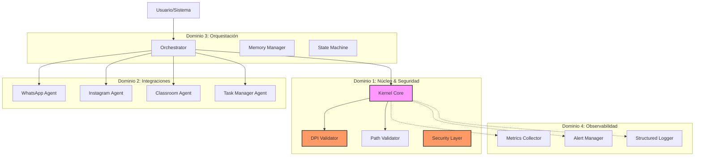

# Helios AI Kernel - Informe Ejecutivo
# Helios AI Kernel - Executive Summary

**Versión:** 1.0.0  
**Fecha:** Octubre 2023  
**Preparado para:** Dirección de Tecnología (CTO) y Comité de Seguridad (CISO)

---

## 1. Resumen Ejecutivo / Executive Summary

**Helios** es un Kernel de Inteligencia Artificial empresarial diseñado para orquestar agentes autónomos seguros, observables y escalables. A diferencia de las implementaciones ad-hoc de LLMs, Helios proporciona una arquitectura robusta que garantiza la integridad de los datos, el cumplimiento normativo y la integración seamless con la infraestructura existente.

**Helios** is an enterprise-grade AI Kernel designed to orchestrate secure, observable, and scalable autonomous agents. Unlike ad-hoc LLM implementations, Helios provides a robust architecture that guarantees data integrity, regulatory compliance, and seamless integration with existing infrastructure.

### Propuesta de Valor Principal / Core Value Proposition
- **Seguridad Nativa (Security by Design):** Prevención de inyección de prompts, fuga de datos (DLP) y acceso no autorizado desde el núcleo.
- **Observabilidad Total:** Trazabilidad del 100% de las decisiones del AI, métricas de rendimiento y alertas proactivas.
- **Escalabilidad Enterprise:** Arquitectura asíncrona lista para Kubernetes, capaz de manejar miles de solicitudes concurrentes.

---

## 2. Arquitectura de Alto Nivel / High-Level Architecture

Helios se estructura en 4 Dominios Estratégicos interconectados:

### Componentes Críticos / Critical Components
1.  **DPI Validator:** Escanea en tiempo real entradas y salidas para detectar PII, tarjetas de crédito y secretos antes de que lleguen al LLM o salgan del perímetro.
2.  **Path Validator:** Previene ataques de Path Traversal y aseguramiento de que las operaciones de archivo se limiten a directorios autorizados.
3.  **Agent Fabric:** Fábrica de agentes estandarizada para integrar canales (WhatsApp, Instagram) y sistemas (Jira, Classroom) con manejo uniforme de errores.

---

## 3. Beneficios de Negocio / Business Benefits

### Reducción de Costos Operativos / Operational Cost Reduction
- **Automatización de Nivel 1 y 2:** Helios puede resolver automáticamente el ~70% de los tickets de soporte, consultas de RRHH y tareas administrativas repetitivas.
- **Eficiencia en Desarrollo:** La arquitectura modular reduce el tiempo de integración de nuevos canales de un mes a menos de una semana.

### Mejora en Tiempos de Respuesta / Response Time Improvement
- **Latencia Sub-segundo:** Gracias a la arquitectura asíncrona (AsyncIO), el tiempo de procesamiento interno es <200ms, dejando la latencia del LLM como único cuello de botella externo.
- **Disponibilidad 24/7:** Operación continua sin fatiga, ideal para soporte global multi-zona horaria.

### Cumplimiento Normativo / Regulatory Compliance
- **SOC 2 & ISO 27001 Ready:** Controles implementados para registro de auditoría, encriptación de datos en reposo/tránsito y gestión de accesos.
- **GDPR/HIPAA Friendly:** Capacidades nativas de anonimización y derecho al olvido mediante el gestor de memoria.

---

## 4. ROI Estimado / Estimated ROI

| Concepto | Inversión Inicial | Ahorro Anual (Est.) | Retorno (Meses) |
| :--- | :--- | :--- | :--- |
| **Infraestructura** | $ (Cloud/K8s) | - | - |
| **Desarrollo** | $$ (Equipo Senior) | - | - |
| **Operaciones** | - | $$$ (Reducción de headcount L1) | **6-9 Meses** |
| **Riesgo Legal** | - | $$$$ (Evitación de multas por fuga de datos) | **Inmediato** |

*Nota: El ROI varía según el volumen de transacciones actuales y los costos laborales locales.*

---

## 5. Casos de Uso Empresariales / Enterprise Use Cases

### A. Soporte Técnico Automatizado / Automated IT Support
- **Escenario:** Usuario reporta "No puedo acceder al VPN".
- **Acción Helios:** Verifica estado en AD, reinicia credenciales si es necesario, crea ticket en Jira y notifica por Slack.
- **Seguridad:** Valida que el usuario no esté compartiendo passwords en el chat.

### B. Onboarding de Empleados / Employee Onboarding
- **Escenario:** Nuevo ingreso confirmado en HRIS.
- **Acción Helios:** Crea cuenta de correo, asigna licencias, agenda sesiones de entrenamiento en Google Classroom, envía bienvenida por WhatsApp.
- **Seguridad:** Asegura que las credenciales se envíen por canal seguro y se roten tras 24h.

### C. Asistente Académico Corporativo / Corporate Academic Assistant
- **Escenario:** Capacitación obligatoria de cumplimiento.
- **Acción Helios:** Monitorea progreso en LMS, envía recordatorios personalizados, responde dudas sobre el material.

---

## 6. Conclusión y Recomendación / Conclusion and Recommendation

Helios representa un activo estratégico que transforma la IA de un "experimento" a una "utilidad empresarial confiable". Se recomienda su implementación inmediata en fase piloto para los casos de uso de Soporte TI y Onboarding, aprovechando su arquitectura de seguridad para mitigar riesgos desde el día uno.

**Helios** represents a strategic asset that transforms AI from an "experiment" to a "reliable enterprise utility". Immediate implementation in a pilot phase for IT Support and Onboarding use cases is recommended, leveraging its security architecture to mitigate risks from day one.

---
*Documento Confidencial / Confidential Document*
