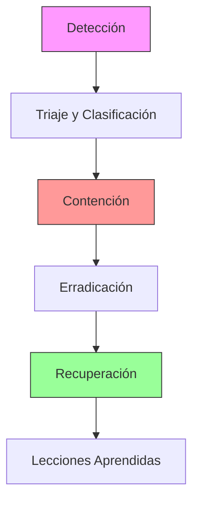

# Helios AI Kernel - Políticas de Seguridad
# Helios AI Kernel - Security Policies

**Versión:** 1.0.0  
**Clasificación:** Confidencial / Confidential  
**Aprobado por:** CISO  
**Fecha de Vigencia:** Octubre 2023

---

## 1. Política de Manejo de Credenciales
## 1. Credential Management Policy

### 1.1 Principios Generales / General Principles

- **Nunca hardcodear credenciales**: Está estrictamente prohibido incluir API keys, passwords, tokens o secretos en el código fuente.
- **Never hardcode credentials**: It is strictly forbidden to include API keys, passwords, tokens, or secrets in source code.

### 1.2 Almacenamiento Seguro / Secure Storage

| Tipo de Secreto | Almacenamiento Permitido | Prohibido |
|-----------------|-------------------------|-----------|
| API Keys (Producción) | HashiCorp Vault, AWS Secrets Manager | .env local, código |
| API Keys (Desarrollo) | .env cifrado, variables de entorno | Repositorio Git |
| Certificados TLS | Kubernetes Secrets (encriptados) | Sistema de archivos plano |
| Passwords DB | Vault + Rotación automática | Texto plano |

### 1.3 Rotación de Credenciales / Credential Rotation

- **Frecuencia Mínima**: Cada 90 días para credenciales de producción.
- **Rotación Inmediata**: Ante cualquier sospecha de compromiso.
- **Automatización**: Helios integra rotación automática vía Vault Agent.

### 1.4 Acceso a Secretos / Secrets Access

```python
# ✅ CORRECTO / CORRECT
from ai_engine.core.config import SecurityConfig
config = SecurityConfig.from_vault()

# ❌ INCORRECTO / INCORRECT
API_KEY = "sk-1234567890abcdef"
```

---

## 2. Política de Acceso y Permisos
## 2. Access and Permissions Policy

### 2.1 Modelo de Autorización / Authorization Model

Helios implementa **RBAC (Role-Based Access Control)** con los siguientes roles:

| Rol | Permisos | Alcance |
|-----|----------|---------|
| `admin` | Total acceso, gestión de usuarios, configuración | Global |
| `operator` | Ejecución de agentes, visualización de logs | Por proyecto |
| `developer` | Desarrollo, testing en staging | Entornos no productivos |
| `auditor` | Solo lectura de logs y métricas | Global (read-only) |
| `service` | Acceso programático limitado | Por servicio específico |

### 2.2 Autenticación Requerida / Required Authentication

- **API REST**: JWT tokens con expiración máxima de 1 hora.
- **Admin Dashboard**: MFA (Multi-Factor Authentication) obligatorio.
- **Service-to-Service**: mTLS o API Keys rotativas.

### 2.3 Principio de Mínimo Privilegio / Principle of Least Privilege

Todo nuevo usuario o servicio debe solicitar únicamente los permisos estrictamente necesarios para su función. Los permisos excesivos serán revocados automáticamente tras auditorías trimestrales.

---

## 3. Política de Auditoría y Logs
## 3. Audit and Logging Policy

### 3.1 Eventos Obligatorios a Registrar / Mandatory Log Events

Todo evento de seguridad DEBE ser registrado con formato JSON estructurado:

1.  **Autenticación**: Login exitoso/fallido, logout, refresh de token.
2.  **Autorización**: Denegaciones de acceso, cambios de rol.
3.  **Acceso a Datos**: Lectura/escritura de datos sensibles (PII).
4.  **Validaciones de Seguridad**: 
    - Intentos de Path Traversal bloqueados.
    - Violaciones de DPI (Data Loss Prevention).
    - Inyección de prompts detectada.
5.  **Cambios de Configuración**: Modificaciones en settings críticos.
6.  **Errores del Sistema**: Excepciones no manejadas, fallos de componentes.

### 3.2 Formato de Log / Log Format

```json
{
  "timestamp": "2023-10-15T14:30:00Z",
  "level": "WARNING",
  "module": "dpi_validator",
  "action": "credit_card_detected",
  "user_id": "usr_12345",
  "session_id": "sess_abcde",
  "source_ip": "192.168.1.100",
  "details": {
    "pattern_matched": "visa_card",
    "redacted": true
  },
  "correlation_id": "corr_xyz789"
}
```

### 3.3 Retención de Logs / Log Retention

| Tipo de Log | Retención | Almacenamiento |
|-------------|-----------|----------------|
| Seguridad (Auth, DPI) | 2 años | S3 Glacier / Cold Storage |
| Operacionales | 90 días | ELK Stack (Hot) |
| Debug | 7 días | Local (rotativo) |

### 3.4 Protección de Logs / Log Protection

- **Integridad**: Hash SHA-256 aplicado a logs de seguridad cada hora.
- **Confidencialidad**: Encriptación AES-256 en reposo.
- **Inmutabilidad**: WORM (Write Once Read Many) para logs de auditoría crítica.

---

## 4. Política de Respuesta a Incidentes
## 4. Incident Response Policy

### 4.1 Clasificación de Incidentes / Incident Classification

| Severidad | Descripción | Tiempo de Respuesta | Ejemplo |
|-----------|-------------|---------------------|---------|
| **CRITICAL** | Fuga de datos confirmada, compromiso total del sistema | < 15 minutos | Exfiltración de PII, ransomware |
| **HIGH** | Intento de ataque exitoso parcial, denegación de servicio | < 1 hora | SQL injection parcialmente exitosa |
| **MEDIUM** | Alertas de seguridad múltiples, comportamiento anómalo | < 4 horas | Brute force detectado |
| **LOW** | Alertas aisladas, falsos positivos | < 24 horas | Login fallido único |

### 4.2 Flujo de Respuesta / Response Workflow



### 4.3 Roles y Responsabilidades / Roles and Responsibilities

- **Incident Commander**: Coordina la respuesta, toma decisiones críticas.
- **Security Lead**: Análisis técnico del incidente, forense.
- **Communications Lead**: Comunicación interna y externa (stakeholders, prensa).
- **Legal Counsel**: Asesoramiento sobre implicaciones legales y regulatorias.

### 4.4 Canales de Reporte / Reporting Channels

- **Email Seguro**: security@helios-enterprise.com (encriptado PGP)
- **Hotline**: +1-XXX-XXX-XXXX (24/7)
- **Portal**: https://security.helios-enterprise.com/report

---

## 5. Plan de Recuperación ante Desastres (DRP)
## 5. Disaster Recovery Plan

### 5.1 Objetivos de Recuperación / Recovery Objectives

| Métrica | Objetivo | Justificación |
|---------|----------|---------------|
| **RTO (Recovery Time Objective)** | < 4 horas | Tiempo máximo aceptable de indisponibilidad |
| **RPO (Recovery Point Objective)** | < 15 minutos | Pérdida máxima de datos aceptable |

### 5.2 Estrategia de Backup / Backup Strategy

- **Frecuencia**: Backups incrementales cada hora, completos diarios.
- **Ubicación**: Al menos una copia off-site (región geográfica diferente).
- **Encriptación**: Todos los backups encriptados con AES-256.
- **Pruebas**: Restauración probada trimestralmente en entorno aislado.

### 5.3 Escenarios de Recuperación / Recovery Scenarios

#### Escenario A: Fallo de Instancia Única
- **Acción**: Auto-scaling group reemplaza instancia automáticamente.
- **Tiempo estimado**: < 5 minutos.

#### Escenario B: Fallo de Zona de Disponibilidad
- **Acción**: Failover automático a zona secundaria.
- **Tiempo estimado**: < 15 minutos.

#### Escenario C: Desastre Regional
- **Acción**: Activación de sitio DR en región alterna.
- **Tiempo estimado**: < 2 horas.
- **Procedimiento**:
  1. Declarar desastre (requiere 2 aprobaciones ejecutivas).
  2. DNS failover a región secundaria.
  3. Restaurar últimos backups validados.
  4. Verificar integridad de datos.
  5. Reanudar operaciones.

### 5.4 Matriz de Comunicación en Crisis / Crisis Communication Matrix

| Stakeholder | Canal | Responsable | Frecuencia |
|-------------|-------|-------------|------------|
| Equipo Ejecutivo | Teléfono/SMS | CEO | Cada 2 horas |
| Clientes Enterprise | Email dedicado | Account Manager | Según SLA |
| Empleados | Slack/Intranet | HR Director | Cada 4 horas |
| Reguladores | Portal oficial | Legal Counsel | Según requerimiento |
| Prensa | Comunicado oficial | PR Director | Único punto de contacto |

---

## 6. Cumplimiento y Auditoría
## 6. Compliance and Audit

### 6.1 Auditorías Internas / Internal Audits

- **Frecuencia**: Trimestral.
- **Alcance**: Revisión de accesos, logs de seguridad, configuración de firewalls.
- **Reporte**: Directo al Comité de Auditoría.

### 6.2 Auditorías Externas / External Audits

- **SOC 2 Type II**: Anual.
- **ISO 27001**: Anual (con vigilancia semestral).
- **Penetration Testing**: Semestral por firma tercera certificada.

### 6.3 Sanciones por Incumplimiento / Non-Compliance Penalties

El incumplimiento de estas políticas puede resultar en:
- Acción disciplinaria hasta terminación de contrato.
- Acciones legales en caso de violación intencional.
- Notificación a autoridades regulatorias si aplica.

---

*Documento aprobado por el Comité de Seguridad de la Información*
*Document approved by the Information Security Committee*

**Última Revisión:** Octubre 2023  
**Próxima Revisión:** Abril 2024
